# Prisma Schema v2.0 - Entity Relationship Diagrams

This document contains Mermaid ER diagrams showing all relationships in the schema.

---

## 1. Authentication & User Management

### Core User Model (Modular Design)

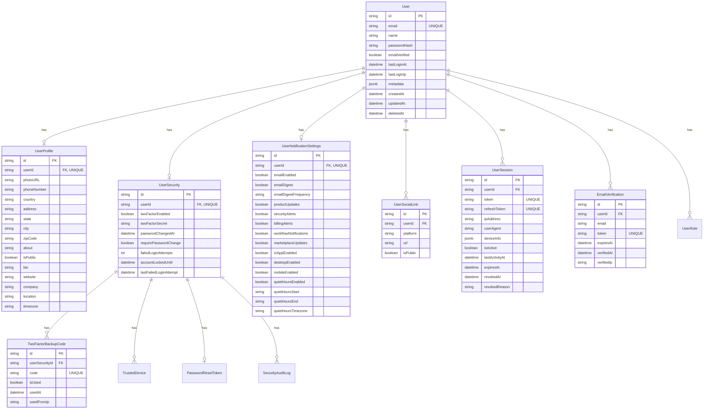

### Role-Based Access Control (RBAC)

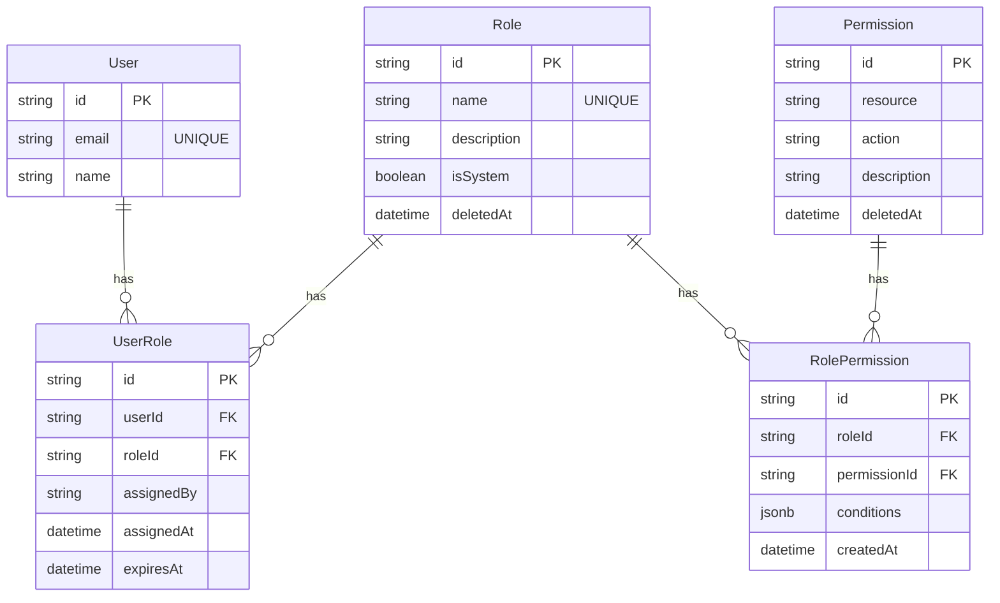

---

## 2. Multi-Tenancy & Organizations

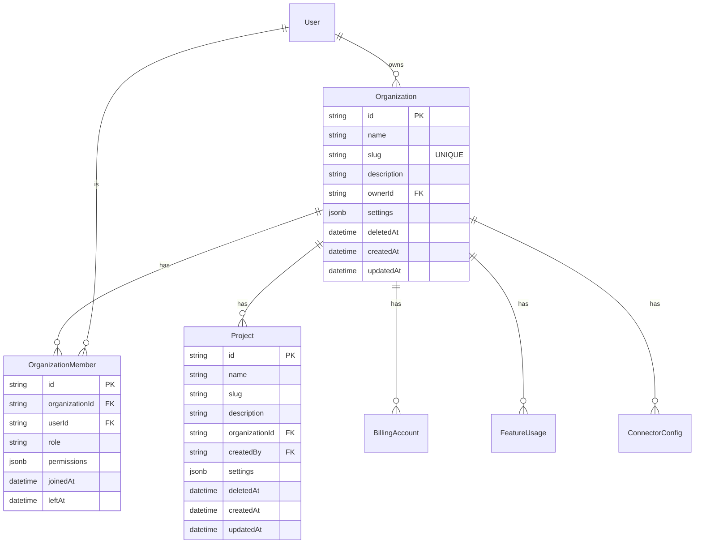

---

## 3. Workflow Engine

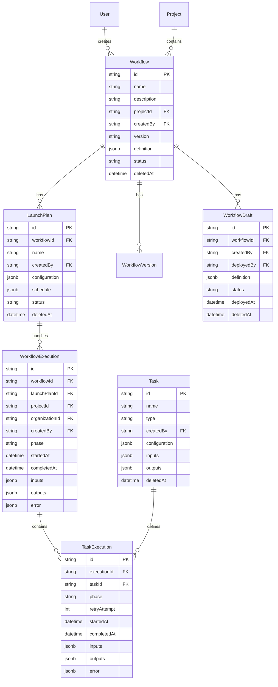

---

## 4. BMaaS (Backend-as-a-Service)

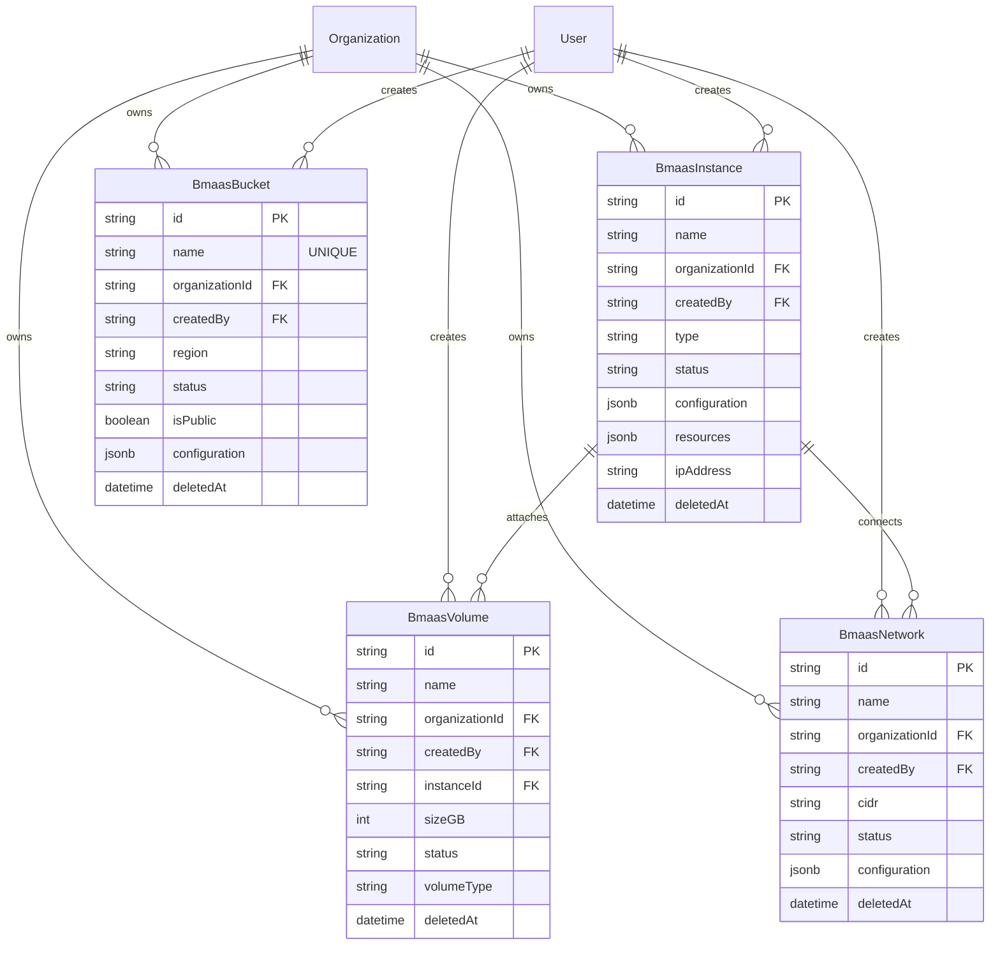

---

## 5. Billing & Usage

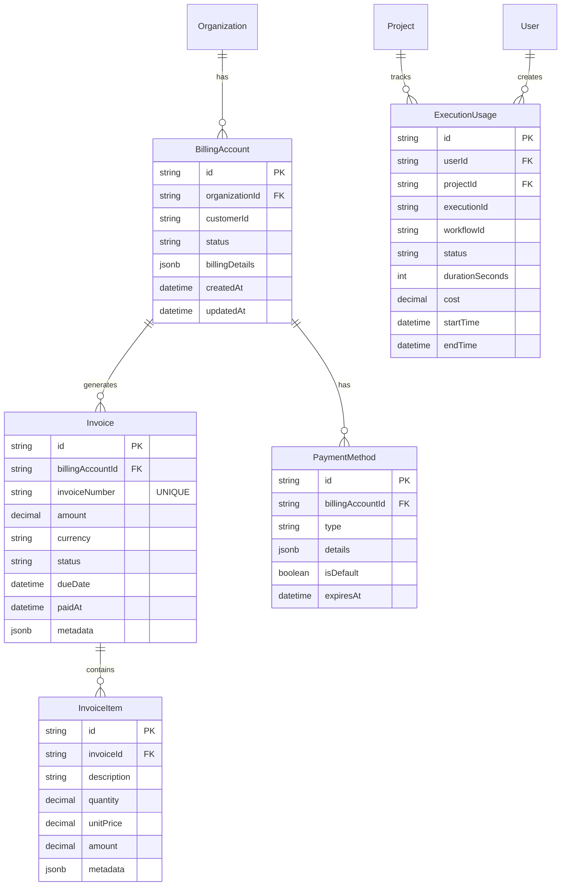

---

## 6. Marketplace & Features

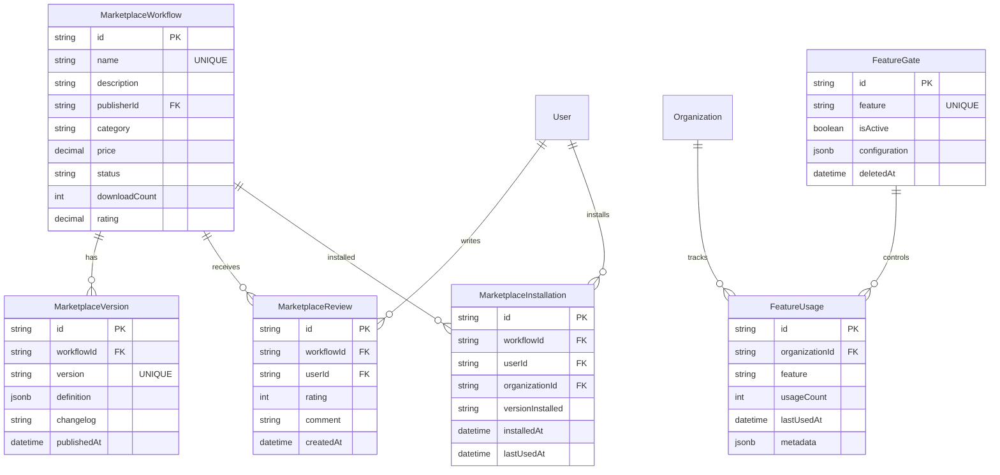

---

## 7. Connectors & Integrations

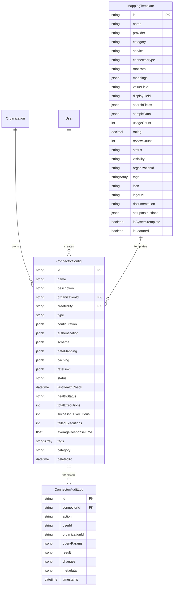

---

## 8. API Management & Webhooks

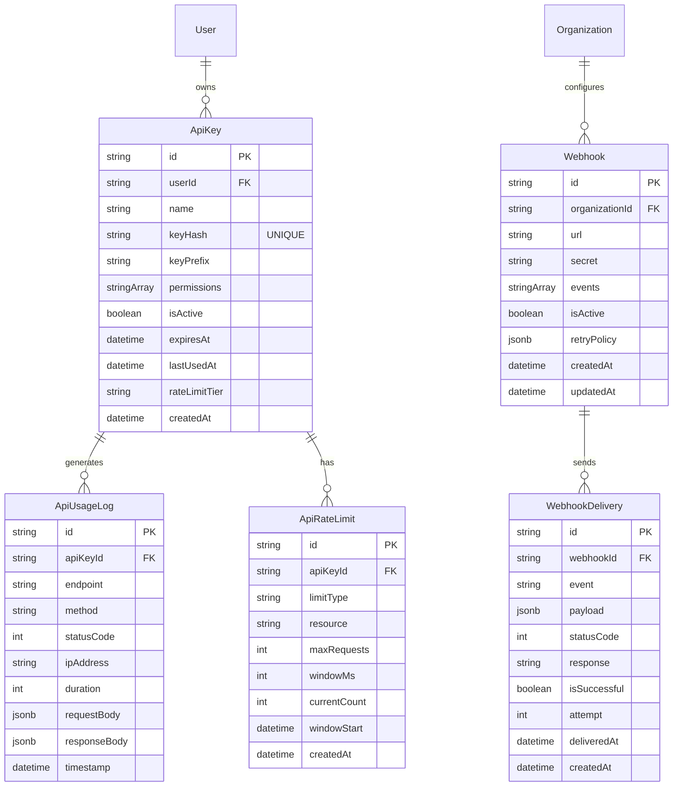

---

## 9. Notification System

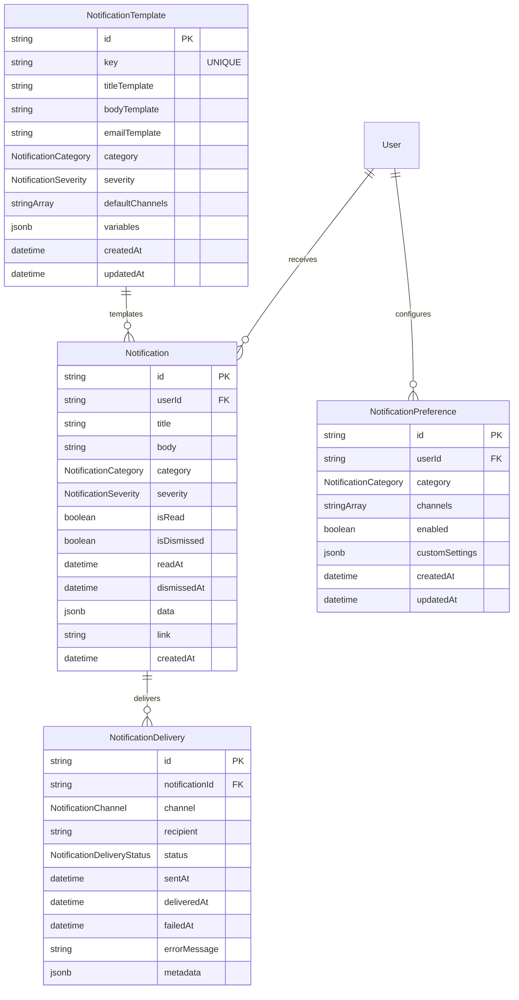

---

## 10. Audit & Monitoring

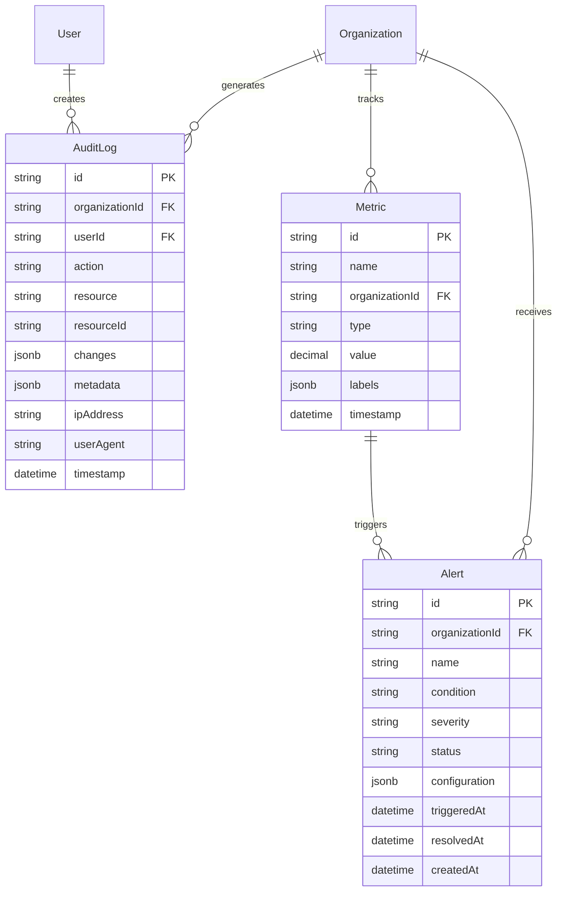

---

## 11. Forms & Dynamic Schemas

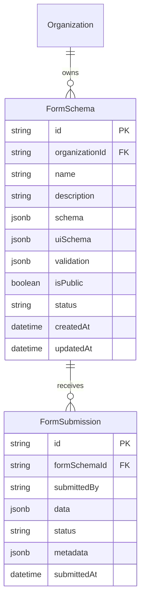

---

## 12. Configuration Management

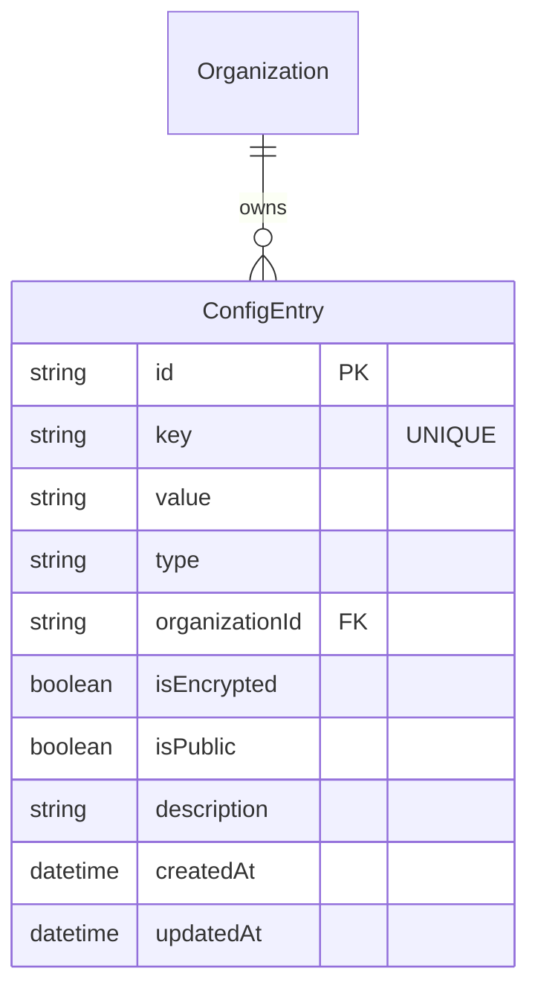

---

## Complete System Overview

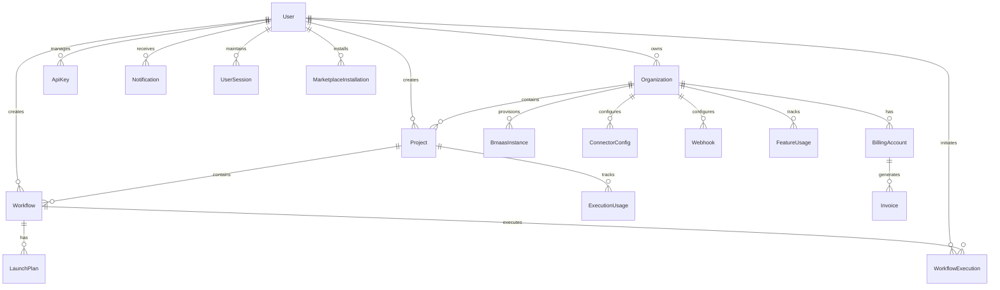

---

## Key Relationships Summary

### One-to-One (||--o|)
- User ↔ UserProfile
- User ↔ UserSecurity
- User ↔ UserNotificationSettings
- UserSecurity ↔ PasswordResetToken

### One-to-Many (||--o{)
- User → UserSessions
- User → Organizations (owned)
- User → Projects (created)
- User → Workflows (created)
- User → Notifications
- User → ApiKeys
- Organization → Projects
- Organization → BillingAccounts
- Organization → Members
- Organization → BMaaS Resources
- Workflow → LaunchPlans
- Workflow → WorkflowExecutions
- BillingAccount → Invoices
- Invoice → InvoiceItems

### Many-to-Many (via join tables)
- User ↔ Role (via UserRole)
- Role ↔ Permission (via RolePermission)
- Organization ↔ User (via OrganizationMember)

---

## Database Constraints

### Foreign Keys
- All FK relations use `onDelete: Cascade` for dependent data
- Creator relations use `onDelete: Restrict` to preserve audit trail
- Soft deletes via `deletedAt` timestamp for audit compliance

### Unique Constraints
- Composite unique: `[userId, platform]` on UserSocialLink
- Composite unique: `[provider, service, connectorType]` on MappingTemplate
- Single column unique: email, token fields, codes, slugs

### Indexes
- All FK columns indexed
- Composite indexes on common query patterns
- Status fields indexed for filtering
- Timestamp fields indexed for range queries
- Full-text search indexes where applicable

---

*Generated: November 20, 2025*
*Schema Version: v2.0*
*Total Models: 90*
*Total Relations: 150+*
